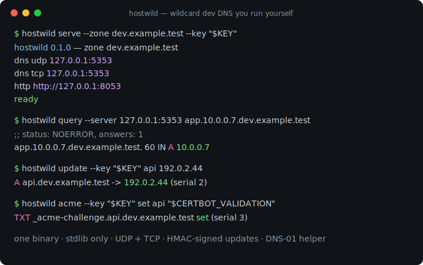
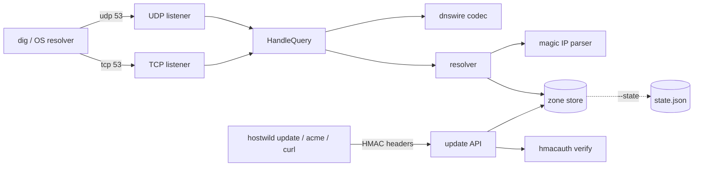

# hostwild

[English](README.md) | [中文](README.zh.md) | [日本語](README.ja.md)

[](LICENSE) [](go.mod) [](CHANGELOG.md)  [](CONTRIBUTING.md)

**hostwild：セルフホスト型ワイルドカード開発 DNS サーバー —— 自分のゾーン配下で nip.io 風のマジックホスト名を提供し、HMAC 署名付き動的更新 API と DNS-01 ヘルパーを備え、DNS ワイヤープロトコルを標準ライブラリのみの Go バイナリ 1 つに直接実装。**



```bash
git clone https://github.com/JaydenCJ/hostwild && cd hostwild
go build -o hostwild ./cmd/hostwild    # single static binary, stdlib only
```

> プレリリース：v0.1.0 はまだどのレジストリにもタグ付けされていません。上記の通りソースからビルドしてください（Go ≥1.22 なら可）。

## なぜ hostwild？

ワイルドカード開発 DNS はプレビュー環境・ブランチ別 URL・ローカル TLS を支える接着剤ですが、多くのチームはそれを nip.io や sslip.io に借りています。それは事故が起きるまでの話：公共リゾルバが落ちれば開発環境が総倒れになり、企業の DNS リバインド保護はプライベート IP を指す応答を黙って握り潰し、自分の所有でないゾーンには `*.dev.example.test` の証明書も取れません。逃げ道の定番は dnsmasq や CoreDNS の自前運用ですが、それは設定スプロールという別の問題との交換です —— テンプレート、プラグイン、動的更新には 2 つ目のサービス、ACME には 3 つ目。hostwild は全部を 1 バイナリに収めます：RFC 1035 ワイヤーフォーマットをネイティブ実装し（UDP 切り詰め、TCP フレーミング、名前圧縮 —— リゾルバライブラリなし、設定 DSL なし）、登録ゼロで `10.0.0.7.dev.example.test` → `10.0.0.7` を 4 記法で応答し、リプレイ窓付き HMAC API で認証済みレコード更新を受け付け、`_acme-challenge` TXT を公開して certbot の DNS-01 をフックスクリプト 1 本にします。

| | hostwild | nip.io / sslip.io | dnsmasq | CoreDNS |
|---|---|---|---|---|
| 公共 DNS 停止・遮断時も動作 | ✅ 自分のもの | ❌ 共有 SaaS | ✅ | ✅ |
| DNS リバインド保護に負けない | ✅ 自分のゾーン | ❌ よく遮断される | ✅ | ✅ |
| マジック IP ホスト名（ドット/ダッシュ/16進/IPv6） | ✅ 内蔵 | ✅ | ⚠️ ダッシュ式のみ・範囲指定 `synth-domain` | ❌ プラグイン不在 |
| 認証付き動的更新 | ✅ リクエスト毎 HMAC | ❌ | ❌ hosts 再読込 | ⚠️ 外部 etcd 前提 |
| DNS-01 チャレンジヘルパー | ✅ 内蔵 | ❌ | ❌ | ⚠️ 別ツール要 |
| 設定面 | CLI フラグのみ | なし（自分の物でない） | 設定ファイル | Corefile + プラグイン |
| ランタイム依存 | 0 | 該当なし | C デーモン | Go + プラグイン群 |

<sub>2026-07-13 時点で確認：hostwild は Go 標準ライブラリのみを import。nip.io は「多くの DNS リゾルバがリバインド型応答を遮断する」と明記。dnsmasq の `--synth-domain` は宣言したアドレス範囲に限りダッシュ式 IPv4 名を合成。CoreDNS の動的更新は通常 etcd や external プラグイン経由。</sub>

## 特長

- **ネイティブなワイヤープロトコル** —— RFC 1035 コーデックをゼロから実装しバイト単位で検証：ヘッダーパッキング、エンコード*と*デコード双方向の名前圧縮（後方限定ポインタ・ホップ上限でループ対策）、UDP は TC ビット付き切り詰め、TCP は 2 バイトフレーミング。
- **4 つのマジック記法** —— `10.0.0.7.…`、`app-10-0-0-7.…`、`0a000007.…`、`2001-db8--7.…` がすべて登録なしで応答。`my-cool-service` のような紛らわしい名前は厳格に拒否し、実名を影で奪いません。
- **署名付き動的更新** —— 全 API リクエストがメソッド・パス・タイムスタンプ・ボディハッシュへの HMAC-SHA256 を携行。古いタイムスタンプは拒否、比較は定数時間、失敗はすべて同一の不透明な 401。
- **フック 1 本で DNS-01** —— `hostwild acme set <name> <token>` が certbot や lego のワイルドカード証明書取得に必要な `_acme-challenge` TXT を公開し、`clear` で除去。
- **誠実な権威サーバー挙動** —— ゾーン外の質問は REFUSED（オープンリゾルバには決してならない）、未該当は RFC 2308 ネガティブキャッシュ用の正しい SOA 付き NXDOMAIN、名前は在るが型が違う場合は NODATA でデュアルスタックを壊しません。
- **再起動を越える状態** —— `--state` が登録をアトミックな rename で diff 可能な JSON に永続化し、変更ごとに SOA シリアルを加算。`--record` で起動時に静的名を播種。
- **依存ゼロ・テレメトリゼロ** —— 標準ライブラリのみ、デフォルトで 127.0.0.1 にバインドし、外向き接続を一切開始しません。

## クイックスタート

```bash
./hostwild serve --zone dev.example.test --key "$KEY"
```

実際にキャプチャした出力：

```text
hostwild 0.1.0 — zone dev.example.test
dns   udp 127.0.0.1:5353
dns   tcp 127.0.0.1:5353
http  http://127.0.0.1:8053
ready
```

マジック名は即応答 —— 登録も設定も不要（実出力）：

```text
$ ./hostwild query --server 127.0.0.1:5353 app.10.0.0.7.dev.example.test
;; status: NOERROR, answers: 1
app.10.0.0.7.dev.example.test.	60	IN	A	10.0.0.7
```

署名 API で安定した名前を登録し、ワイルドカード証明書を取得（実出力）：

```text
$ ./hostwild update --key "$KEY" api 192.0.2.44
A api.dev.example.test -> 192.0.2.44 (serial 2)

$ ./hostwild acme --key "$KEY" set api 4dModq3K-demo-value
TXT _acme-challenge.api.dev.example.test set (serial 3)

$ ./hostwild query --server 127.0.0.1:5353 --type TXT _acme-challenge.api.dev.example.test
;; status: NOERROR, answers: 1
_acme-challenge.api.dev.example.test.	30	IN	TXT	"4dModq3K-demo-value"
```

実ゾーンを公開するには、レジストラで一度だけ委任し（`dev.example.test NS ns.dev.example.test` とホストへのグルー A レコード）、`--dns 0.0.0.0:53 --apex <public-ip>` で起動します。`examples/` にループバック完結のセッションと certbot フックがあります。

## CLI リファレンス

`hostwild serve|resolve|query|update|acme|list|sign|version` —— 終了コード：0 正常、1 応答なし、2 使い方エラー、3 実行時エラー。`serve` の主要フラグ：

| フラグ | デフォルト | 効果 |
|---|---|---|
| `--zone` | —（必須） | hostwild が権威を持つゾーン頂点 |
| `--dns` | `127.0.0.1:5353` | DNS 待受アドレス、UDP と TCP（`:0` でポートを表示） |
| `--http` | `127.0.0.1:8053` | 更新 API アドレス。`--no-http` で無効化 |
| `--key` / `--key-file` | 環境変数 `HOSTWILD_KEY` | API の共有 HMAC キー |
| `--ttl` / `--neg-ttl` | `60` / `60` | 応答 TTL とネガティブキャッシュ（SOA minimum）TTL |
| `--apex` | — | ゾーン頂点とその NS ホストへの A/AAAA 応答 |
| `--fallback` | — | どの規則にも該当しない名前への包括アドレス |
| `--record` | — | 静的レコードの播種、`name=address`（複数可） |
| `--state` | メモリのみ | 動的レコードを再起動越しに保持する JSON ファイル |
| `--auth-window` | `5m` | HMAC タイムスタンプ許容窓 |

解決の優先順位とマジック記法の文法は [docs/resolution.md](docs/resolution.md)、署名方式と全 API ルートは [docs/update-api.md](docs/update-api.md) を参照。

## 検証

このリポジトリは CI を同梱しません。上記の主張はすべてローカル実行で検証します：

```bash
go test ./...            # 89 deterministic tests, loopback only, < 5 s
bash scripts/smoke.sh    # real server end-to-end, prints SMOKE OK
```

## アーキテクチャ



## ロードマップ

- [x] v0.1.0 —— ネイティブ RFC 1035 コーデック（UDP+TCP）、4 つのマジック記法、優先順位リゾルバ、HMAC 更新 API、DNS-01 ヘルパー、状態永続化、89 テスト + smoke スクリプト
- [ ] ウォームスタンバイ用セカンダリへのゾーン転送（AXFR）
- [ ] 名前単位の更新キーで CI ジョブを自分のレコードだけに限定
- [ ] 同一 LAN 内 `.local` 発見のための任意 mDNS ブリッジ
- [ ] 既存 HTTP リスナー上の Prometheus 形式 `/metrics`
- [ ] より大きな UDP ペイロードのための EDNS(0) OPT 対応

全リストは [open issues](https://github.com/JaydenCJ/hostwild/issues) を参照。

## コントリビュート

Issue・議論・PR を歓迎します —— ローカルの手順（フォーマット、vet、テスト、`SMOKE OK`）は [CONTRIBUTING.md](CONTRIBUTING.md) を参照。入門タスクは [good first issue](https://github.com/JaydenCJ/hostwild/issues?q=is%3Aissue+is%3Aopen+label%3A%22good+first+issue%22)、設計の議論は [Discussions](https://github.com/JaydenCJ/hostwild/discussions) にどうぞ。

## ライセンス

[MIT](LICENSE)
