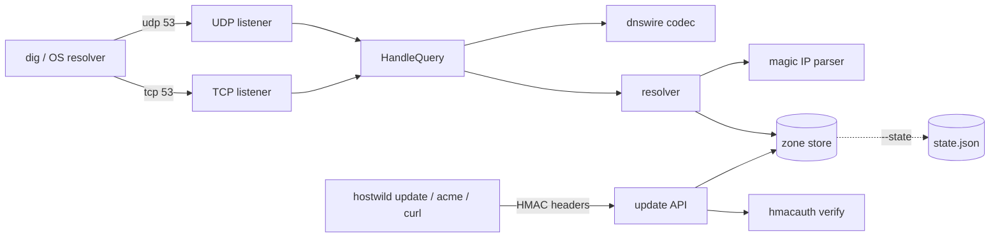

# hostwild

[English](README.md) | [中文](README.zh.md) | [日本語](README.ja.md)

[](LICENSE) [](go.mod) [](CHANGELOG.md)  [](CONTRIBUTING.md)

**hostwild：a self-hosted wildcard dev DNS server — nip.io-style magic hostnames under your own zone, plus an HMAC-signed dynamic-update API and a DNS-01 helper, with the DNS wire protocol implemented directly in one stdlib-only Go binary.**


```bash
git clone https://github.com/JaydenCJ/hostwild && cd hostwild
go build -o hostwild ./cmd/hostwild    # single static binary, stdlib only
```

> Pre-release: v0.1.0 is not tagged on a package registry yet; build from source as above (any Go ≥1.22).

## Why hostwild?

Wildcard dev DNS is the glue under preview environments, per-branch URLs, and local TLS — and most teams rent it from nip.io or sslip.io. That works until it doesn't: the public resolvers go down and every dev setup breaks with them, corporate DNS-rebind protection silently swallows answers that point at private IPs, and you can't get a `*.dev.example.test` certificate for a zone you don't control. The usual escape hatch is running dnsmasq or CoreDNS yourself, which trades one problem for a config-sprawl one — templates, plugins, a second service for dynamic updates, a third for ACME. hostwild is the whole story in one binary: it speaks the RFC 1035 wire format natively (UDP truncation, TCP framing, name compression — no resolver library, no config DSL), answers `10.0.0.7.dev.example.test` → `10.0.0.7` in four notations with zero registration, takes authenticated record updates over a replay-bounded HMAC API, and publishes `_acme-challenge` TXT records so certbot's DNS-01 dance is one hook script.

| | hostwild | nip.io / sslip.io | dnsmasq | CoreDNS |
|---|---|---|---|---|
| Works when public DNS is down / filtered | ✅ yours | ❌ shared SaaS | ✅ | ✅ |
| Survives DNS-rebind protection | ✅ your zone | ❌ commonly blocked | ✅ | ✅ |
| Magic IP hostnames (dotted/dashed/hex/IPv6) | ✅ built in | ✅ | ⚠️ dashed only, per-range `synth-domain` | ❌ plugin gap |
| Authenticated dynamic updates | ✅ HMAC per request | ❌ | ❌ hosts-file reload | ⚠️ external etcd |
| DNS-01 challenge helper | ✅ built in | ❌ | ❌ | ⚠️ separate tooling |
| Config surface | CLI flags only | none (not yours) | conf files | Corefile + plugins |
| Runtime dependencies | 0 | n/a | C daemon | Go, plugin tree |

<sub>Checked 2026-07-13: hostwild imports the Go standard library only; nip.io documents that "many DNS resolvers block rebind-style answers"; dnsmasq's `--synth-domain` synthesizes dashed IPv4 names for a declared address range only; CoreDNS dynamic updates typically route through the etcd or external plugins.</sub>

## Features

- **Native wire protocol** — the RFC 1035 codec is implemented from scratch and byte-tested: header packing, name compression on encode *and* decode (backward-only pointers, hop caps against loops), UDP with correct TC-bit truncation, TCP with two-byte framing.
- **Four magic notations** — `10.0.0.7.…`, `app-10-0-0-7.…`, `0a000007.…`, and `2001-db8--7.…` all answer without registration; near-misses like `my-cool-service` are strictly rejected so real names never get shadowed.
- **Signed dynamic updates** — every API request carries an HMAC-SHA256 over method, path, timestamp, and body-hash; stale timestamps bounce, comparisons are constant-time, and all failures return the same opaque 401.
- **DNS-01 in one hook** — `hostwild acme set <name> <token>` publishes the `_acme-challenge` TXT record certbot or lego needs for wildcard certificates; `clear` removes it.
- **Honest authoritative behavior** — out-of-zone questions are REFUSED (never an open resolver), misses are NXDOMAIN with a proper SOA for RFC 2308 negative caching, and existing-name/wrong-type gets NODATA so dual-stack clients keep working.
- **State that survives restarts** — `--state` persists registrations as diffable JSON via atomic rename, with the SOA serial bumped on every change; `--record` seeds static names at startup.
- **Zero dependencies, zero telemetry** — standard library only, binds 127.0.0.1 by default, initiates no outbound connections, ever.

## Quickstart

```bash
./hostwild serve --zone dev.example.test --key "$KEY"
```

Real captured output:

```text
hostwild 0.1.0 — zone dev.example.test
dns   udp 127.0.0.1:5353
dns   tcp 127.0.0.1:5353
http  http://127.0.0.1:8053
ready
```

Magic names answer immediately — no registration, no config (real output):

```text
$ ./hostwild query --server 127.0.0.1:5353 app.10.0.0.7.dev.example.test
;; status: NOERROR, answers: 1
app.10.0.0.7.dev.example.test.	60	IN	A	10.0.0.7
```

Register a stable name over the signed API, then get a wildcard cert (real output):

```text
$ ./hostwild update --key "$KEY" api 192.0.2.44
A api.dev.example.test -> 192.0.2.44 (serial 2)

$ ./hostwild acme --key "$KEY" set api 4dModq3K-demo-value
TXT _acme-challenge.api.dev.example.test set (serial 3)

$ ./hostwild query --server 127.0.0.1:5353 --type TXT _acme-challenge.api.dev.example.test
;; status: NOERROR, answers: 1
_acme-challenge.api.dev.example.test.	30	IN	TXT	"4dModq3K-demo-value"
```

To serve a real zone, delegate it once at your registrar (`dev.example.test NS ns.dev.example.test` + a glue A record for your host) and run with `--dns 0.0.0.0:53 --apex <public-ip>`. `examples/` has a full loopback session and a certbot hook.

## CLI reference

`hostwild serve|resolve|query|update|acme|list|sign|version` — exit codes: 0 ok, 1 no answer, 2 usage error, 3 runtime error. Key flags for `serve`:

| Flag | Default | Effect |
|---|---|---|
| `--zone` | — (required) | the apex hostwild is authoritative for |
| `--dns` | `127.0.0.1:5353` | DNS listen address, UDP and TCP (`:0` prints the port) |
| `--http` | `127.0.0.1:8053` | update-API address; `--no-http` disables it |
| `--key` / `--key-file` | `HOSTWILD_KEY` env | shared HMAC key for the API |
| `--ttl` / `--neg-ttl` | `60` / `60` | answer TTL and negative-caching (SOA minimum) TTL |
| `--apex` | — | A/AAAA answer for the apex and its NS host |
| `--fallback` | — | catch-all address for names nothing else matched |
| `--record` | — | seed a static record, `name=address` (repeatable) |
| `--state` | memory only | JSON file persisting dynamic records across restarts |
| `--auth-window` | `5m` | HMAC timestamp acceptance window |

Resolution precedence and the magic-notation grammar are specified in [docs/resolution.md](docs/resolution.md); the signing scheme and every API route in [docs/update-api.md](docs/update-api.md).

## Verification

This repository ships no CI; every claim above is verified by local runs:

```bash
go test ./...            # 89 deterministic tests, loopback only, < 5 s
bash scripts/smoke.sh    # real server end-to-end, prints SMOKE OK
```

## Architecture



## Roadmap

- [x] v0.1.0 — native RFC 1035 codec (UDP+TCP), four magic notations, precedence resolver, HMAC update API, DNS-01 helper, state persistence, 89 tests + smoke script
- [ ] Zone transfers out (AXFR) for a warm-standby secondary
- [ ] Per-name update keys so CI jobs can only touch their own records
- [ ] Optional mDNS bridge for `.local` discovery on the same LAN
- [ ] Prometheus-format `/metrics` on the existing HTTP listener
- [ ] EDNS(0) OPT handling for larger UDP payloads

See the [open issues](https://github.com/JaydenCJ/hostwild/issues) for the full list.

## Contributing

Issues, discussions and pull requests are welcome — see [CONTRIBUTING.md](CONTRIBUTING.md) for the local workflow (format, vet, tests, `SMOKE OK`). Good entry points are labelled [good first issue](https://github.com/JaydenCJ/hostwild/issues?q=is%3Aissue+is%3Aopen+label%3A%22good+first+issue%22), and design questions live in [Discussions](https://github.com/JaydenCJ/hostwild/discussions).

## License

[MIT](LICENSE)
