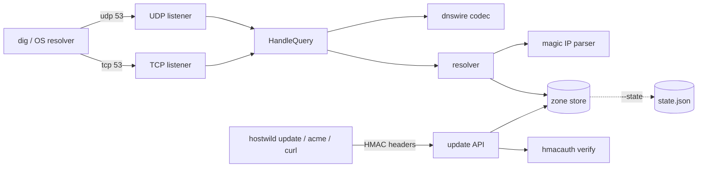

# hostwild

[English](README.md) | [中文](README.zh.md) | [日本語](README.ja.md)

[](LICENSE) [](go.mod) [](CHANGELOG.md)  [](CONTRIBUTING.md)

**hostwild：自托管的通配符开发 DNS 服务器 —— 在你自己的域名下提供 nip.io 风格的魔法主机名，外加 HMAC 签名的动态更新 API 和 DNS-01 助手，DNS 线路协议在一个仅依赖标准库的 Go 二进制中直接实现。**


```bash
git clone https://github.com/JaydenCJ/hostwild && cd hostwild
go build -o hostwild ./cmd/hostwild    # single static binary, stdlib only
```

> 预发布：v0.1.0 尚未在任何包注册表上打标签；请按上述方式从源码构建（任意 Go ≥1.22）。

## 为什么选 hostwild？

通配符开发 DNS 是预览环境、按分支 URL、本地 TLS 之下的粘合剂 —— 而多数团队把它租给了 nip.io 或 sslip.io。这在出事之前都没问题：公共解析器一宕机，所有开发环境跟着一起挂；企业的 DNS 重绑定保护会悄悄吞掉指向内网 IP 的应答；而且你无法为一个不属于你的域申请 `*.dev.example.test` 证书。常见的退路是自己跑 dnsmasq 或 CoreDNS，但那是用一个问题换来配置蔓延的问题 —— 模板、插件、动态更新要第二个服务、ACME 要第三个。hostwild 把整个故事装进一个二进制：原生实现 RFC 1035 线路格式（UDP 截断、TCP 帧、域名压缩 —— 没有解析库，没有配置 DSL），无需注册即以四种记法回答 `10.0.0.7.dev.example.test` → `10.0.0.7`，通过带重放窗口的 HMAC API 接收认证过的记录更新，并发布 `_acme-challenge` TXT 记录，让 certbot 的 DNS-01 流程只需一个 hook 脚本。

| | hostwild | nip.io / sslip.io | dnsmasq | CoreDNS |
|---|---|---|---|---|
| 公共 DNS 宕机/被过滤时仍可用 | ✅ 归你所有 | ❌ 共享 SaaS | ✅ | ✅ |
| 不受 DNS 重绑定保护影响 | ✅ 你的域 | ❌ 常被拦截 | ✅ | ✅ |
| 魔法 IP 主机名（点分/横线/十六进制/IPv6） | ✅ 内置 | ✅ | ⚠️ 仅横线式，按网段 `synth-domain` | ❌ 插件缺口 |
| 带认证的动态更新 | ✅ 每请求 HMAC | ❌ | ❌ hosts 文件重载 | ⚠️ 依赖外部 etcd |
| DNS-01 质询助手 | ✅ 内置 | ❌ | ❌ | ⚠️ 需另配工具 |
| 配置面 | 仅 CLI 参数 | 无（不归你） | 配置文件 | Corefile + 插件 |
| 运行时依赖 | 0 | 不适用 | C 守护进程 | Go + 插件树 |

<sub>核对于 2026-07-13：hostwild 仅导入 Go 标准库；nip.io 文档写明"许多 DNS 解析器会拦截重绑定式应答"；dnsmasq 的 `--synth-domain` 只为声明的地址段合成横线式 IPv4 名称；CoreDNS 的动态更新通常经由 etcd 或 external 插件。</sub>

## 特性

- **原生线路协议** —— RFC 1035 编解码从零实现并逐字节测试：头部打包，编码*与*解码双向的域名压缩（指针只许向后、跳数封顶防环），UDP 正确置 TC 位截断，TCP 双字节帧。
- **四种魔法记法** —— `10.0.0.7.…`、`app-10-0-0-7.…`、`0a000007.…`、`2001-db8--7.…` 全部无需注册即可应答；`my-cool-service` 这类近似名被严格拒绝，真实名称永不被遮蔽。
- **签名的动态更新** —— 每个 API 请求都携带对方法、路径、时间戳、正文哈希的 HMAC-SHA256；过期时间戳被拒，比较恒定时间，所有失败返回同一个不透明的 401。
- **一个 hook 搞定 DNS-01** —— `hostwild acme set <name> <token>` 发布 certbot 或 lego 申请通配符证书所需的 `_acme-challenge` TXT 记录；`clear` 予以清除。
- **诚实的权威行为** —— 域外问题一律 REFUSED（绝不做开放解析器），未命中返回带规范 SOA 的 NXDOMAIN 以支持 RFC 2308 负缓存，名称存在但类型不符时返回 NODATA，双栈客户端不受影响。
- **跨重启的状态** —— `--state` 通过原子重命名把注册持久化为可 diff 的 JSON，每次变更递增 SOA 序列号；`--record` 在启动时播种静态名称。
- **零依赖、零遥测** —— 仅标准库，默认绑定 127.0.0.1，永不发起任何出站连接。

## 快速上手

```bash
./hostwild serve --zone dev.example.test --key "$KEY"
```

真实捕获的输出：

```text
hostwild 0.1.0 — zone dev.example.test
dns   udp 127.0.0.1:5353
dns   tcp 127.0.0.1:5353
http  http://127.0.0.1:8053
ready
```

魔法名称立即可答 —— 无需注册、无需配置（真实输出）：

```text
$ ./hostwild query --server 127.0.0.1:5353 app.10.0.0.7.dev.example.test
;; status: NOERROR, answers: 1
app.10.0.0.7.dev.example.test.	60	IN	A	10.0.0.7
```

通过签名 API 注册一个稳定名称，然后申请通配符证书（真实输出）：

```text
$ ./hostwild update --key "$KEY" api 192.0.2.44
A api.dev.example.test -> 192.0.2.44 (serial 2)

$ ./hostwild acme --key "$KEY" set api 4dModq3K-demo-value
TXT _acme-challenge.api.dev.example.test set (serial 3)

$ ./hostwild query --server 127.0.0.1:5353 --type TXT _acme-challenge.api.dev.example.test
;; status: NOERROR, answers: 1
_acme-challenge.api.dev.example.test.	30	IN	TXT	"4dModq3K-demo-value"
```

要对外服务真实域，只需在注册商处委派一次（`dev.example.test NS ns.dev.example.test` 外加指向你主机的胶水 A 记录），再以 `--dns 0.0.0.0:53 --apex <public-ip>` 运行。`examples/` 里有完整的本机会话和 certbot hook。

## CLI 参考

`hostwild serve|resolve|query|update|acme|list|sign|version` —— 退出码：0 正常，1 无应答，2 用法错误，3 运行时错误。`serve` 的关键参数：

| 参数 | 默认值 | 作用 |
|---|---|---|
| `--zone` | —（必填） | hostwild 作为权威的域顶点 |
| `--dns` | `127.0.0.1:5353` | DNS 监听地址，UDP 与 TCP（`:0` 会打印端口） |
| `--http` | `127.0.0.1:8053` | 更新 API 地址；`--no-http` 可禁用 |
| `--key` / `--key-file` | `HOSTWILD_KEY` 环境变量 | API 的共享 HMAC 密钥 |
| `--ttl` / `--neg-ttl` | `60` / `60` | 应答 TTL 与负缓存（SOA minimum）TTL |
| `--apex` | — | 域顶点及其 NS 主机的 A/AAAA 应答 |
| `--fallback` | — | 其余规则都未命中时的兜底地址 |
| `--record` | — | 播种静态记录，`name=address`（可重复） |
| `--state` | 仅内存 | 跨重启持久化动态记录的 JSON 文件 |
| `--auth-window` | `5m` | HMAC 时间戳接受窗口 |

解析优先级与魔法记法文法见 [docs/resolution.md](docs/resolution.md)；签名方案与全部 API 路由见 [docs/update-api.md](docs/update-api.md)。

## 验证

本仓库不带 CI；以上每一条声明都由本地运行验证：

```bash
go test ./...            # 89 deterministic tests, loopback only, < 5 s
bash scripts/smoke.sh    # real server end-to-end, prints SMOKE OK
```

## 架构



## 路线图

- [x] v0.1.0 —— 原生 RFC 1035 编解码（UDP+TCP）、四种魔法记法、优先级解析器、HMAC 更新 API、DNS-01 助手、状态持久化、89 个测试 + smoke 脚本
- [ ] 对外区域传送（AXFR），支持热备从服务器
- [ ] 按名称划分的更新密钥，让 CI 任务只能改动自己的记录
- [ ] 可选 mDNS 桥接，在同一局域网发现 `.local`
- [ ] 在现有 HTTP 监听上提供 Prometheus 格式 `/metrics`
- [ ] EDNS(0) OPT 处理以支持更大的 UDP 载荷

完整列表见 [open issues](https://github.com/JaydenCJ/hostwild/issues)。

## 贡献

欢迎 issue、讨论与 PR —— 本地流程（格式化、vet、测试、`SMOKE OK`）见 [CONTRIBUTING.md](CONTRIBUTING.md)。入门任务标注为 [good first issue](https://github.com/JaydenCJ/hostwild/issues?q=is%3Aissue+is%3Aopen+label%3A%22good+first+issue%22)，设计讨论在 [Discussions](https://github.com/JaydenCJ/hostwild/discussions)。

## 许可证

[MIT](LICENSE)
